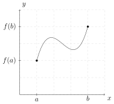
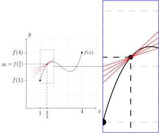
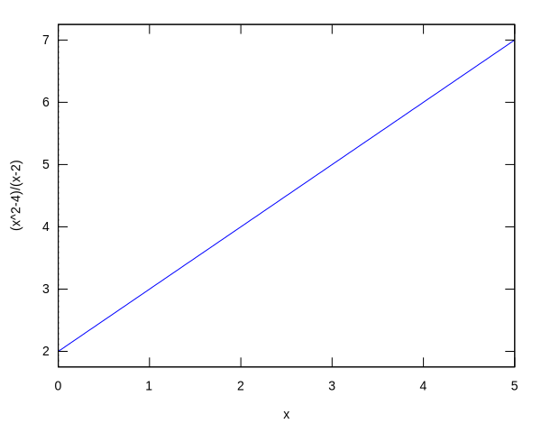

# Limits

In order to find instantaneous rate of change of a function using only one point and a special type of function; one must go beyond exact and perceive close enough.

## Average Rate of Change (Slope)

### Slope:

Recall the slope of a line passing through two points $(x_1,y_1)$ and $(x_2,y_2)$ is given by

$$m=\frac{\Delta y}{\Delta x}$$

where $\Delta y = y_2 - y_1$ and $\Delta x = x_2 - x_1$. We say the change in the vertical direction (the $y$-direction) is $\Delta y$ and the change in the horizontal direction (the $x$-direction) is $\Delta x$.


### A "Nice" Function:
Next, consider a "nice" function $y=f(x)=\frac{2 x^3}{3}-5 x^2+\frac{35 x}{3}-\frac{16}{3}$. Define the domain of $f$ as the set of all $x$ values on a closed interval $[a,b]$.



If there are two values $x_1,x_2$ such that $a<x_1<x_2<b$, then $f(x_1)$, $f(x_2)$ exists and a line will pass through the points $(x_1,f(x_1))$ and $(x_2,f(x_2))$.


Let's call this line $y=S(x)$. The slope of $S(x)$ is

$$m=\dfrac{f(x_2)-(f(x_1)}{x_2-x_1}.$$

Next, use the point-slope form line equation:

$$y-y_1=m(x-x_1).$$

in order to construct the line equation $S(x)$ using the slope $m$ and the point $(x_1,f(x_1))$:

$$S(x)-f(x_1)=m(x-x_1)$$

solving for $S(x)$ we have:

$$S(x)=m(x-x_1)+f(x_1).$$

This is called a secant line through the function $f$ and the two points $(x_1,x_2)$.

### Visual:

Let's consider a visual of what is happening here:


```maxima
f(x):=2*x^3/3-5*x^2+35*x/3-16/3$
a:1$ b:4$ x1:1.5$ x2:3.5$
m(x1,x2):=(f(x2)-f(x1))/(x2-x1)$
S(x,x1,x2):=m(x1,x2)*(x-x1)+f(x1)$
plot2d([
    f(x),
    S(x,x1,x2)
    ],
    [x,0,5],
    [legend,"f(x)","S(x)"]);
```


```maxima
m(3/2,7/2);
```

$$\tag{${\it \%o}_{9}$}-\frac{1}{6}$$

We see here the the average rate of change of the function $f(x)$ over the interval $(x_1,x_2)=(1.5,3.5)$ is about $-\frac{1}{6}$.

Let's consider what happens to the average rate of change as the function values approach $x=1.5$ from the left and from the right.

### From the Left:

From the left we will use the intervals:

$$[1,\frac32],[\frac{9}{8},\frac32],[\frac54,\frac32],[\frac{11}{8},\frac32].$$

This yields a $\Delta x = \{\frac12,\frac38,\frac14,\frac18\}$.


```maxima
m([1,9/8,5/4,11/8],[3/2,3/2,3/2,3/2]);
float(%);
```

$$\tag{${\it \%o}_{10}$}\left[ \frac{7}{3} , \frac{193}{96} , \frac{41}{24} , \frac{137}{96} \right] $$

$$\tag{${\it \%o}_{11}$}\left[ 2.333333333333333 , 2.010416666666667 , 1.708333333333333 , 1.427083333333333 \right] $$


|$x_1$|$x_2$|$m$ Average Rate of Change from $x_2$ to $x_1$|
|:---|:---|:---|
|$1$|$\frac32$|$\frac73=2.\bar3$|
|$\frac98$|$\frac32$|$\frac{193}{96}=2.01041\bar6$|
|$\frac54$|$\frac32$|$\frac{41}{24}=1.708\bar3$|
|$\frac{11}{8}$|$\frac32$|$\frac{137}{96}=1.42708\bar3$|


```maxima
expand(S(x,[1,9/8,5/4,11/8],3/2));
```

$$\tag{${\it \%o}_{12}$}\left[ \frac{7\,x}{3}-\frac{1}{3} , \frac{193\,x}{96}+\frac{29}{192} , \frac{41\,x}{24}+\frac{29}{48} , \frac{137\,x}{96}+\frac{197}{192} \right] $$


### From the Right:

From the right we will use the intervals:

$$[\frac32,\frac{13}{8}],[\frac32,\frac74],[\frac32,\frac{15}{8}],[\frac32,2].$$

This yields $\Delta x = \{ \frac18,\frac14,\frac38,\frac12 \}$.

|$x_1$|$x_2$|$m$ Average Rate of Change from $x_2$ to $x_1$|
|:---|:---|:---|
|$\frac32$|$\frac{13}{8}$|$\frac{89}{96}=0.92708\bar3$|
|$\frac32$|$\frac74$|$\frac{17}{24}=0.708\bar3$|
|$\frac32$|$\frac{15}{8}$|$\frac{49}{96}=0.51041\bar6$|
|$\frac32$|$2$|$\frac13=0.\bar3$|




```maxima
expand(S(x,3/2,[13/8,7/4,15/8,2]));
```

$$\tag{${\it \%o}_{13}$}\left[ \frac{89\,x}{96}+\frac{341}{192} , \frac{17\,x}{24}+\frac{101}{48} , \frac{49\,x}{96}+\frac{461}{192} , \frac{x}{3}+\frac{8}{3} \right] $$


So, to recap:

$$f(x)=\frac{2x^3}{3}-5x^2+\frac{35x}{3}-\frac{16}{3}$$

with out loss of generality the average rate of change of the function $f$ from $x_2$ to $x_1$ will be defined as:

$$m=\dfrac{f(x_2)-f(x_1)}{x_2-x_1}.$$

|$x_1$|$x_2$|$m$ Average Rate of Change from $x_2$ to $x_1$|
|:---|:---|:---|
|$1$|$\frac32$|$\frac73=2.\bar3$|
|$\frac98$|$\frac32$|$\frac{193}{96}=2.01041\bar6$|
|$\frac54$|$\frac32$|$\frac{41}{24}=1.708\bar3$|
|$\frac{11}{8}$|$\frac32$|$\frac{137}{96}=1.42708\bar3$|
|$\frac32$|$\frac{13}{8}$|$\frac{89}{96}=0.92708\bar3$|
|$\frac32$|$\frac74$|$\frac{17}{24}=0.708\bar3$|
|$\frac32$|$\frac{15}{8}$|$\frac{49}{96}=0.51041\bar6$|
|$\frac32$|$2$|$\frac13=0.\bar3$|


```maxima
m(3/2,3/2);
```

```maxima
    expt: undefined: 0 to a negative exponent.
    #0: m(x1=3/2,x2=3/2) (92697F2DD3884DF64C81787A5BE5B130-984089857.mac line 2)
     -- an error. To debug this try: debugmode(true);
```


### Error:

Notice that when $x_1=x_2=1.5$ or $\frac32$ the slope is undefined. This can be seen by the following work:


```maxima
'(f(3/2))=f(3/2);
```

$$\tag{${\it \%o}_{15}$}f\left(\frac{3}{2}\right)=\frac{19}{6}$$


$$
\begin{align}
    \frac{f(x_2)-f(x_2)}{x_2 - x_1 } & = \frac{\frac{19}{6}-\frac{19}{6}}{\frac32 - \frac32}\\
        & = \frac{0}{0}
\end{align}
$$

*Important*: when $m=\dfrac{\Delta y}{\Delta x} = \frac00$ we say the average rate of change is underfined.

*Important*: when evaluating $m=\dfrac{f(x_2)-f(x_1)}{x_2 - x_1}$ we are evaluating exactly $f$ at $x_1$ and $x_2$.

From the "nice" function there should be a line that has a defined slope at the point $(\frac32,\frac{19}{6})$ and touching the curve. However, letting $x_1=x_2=\frac32=1.5$ and evaluating $m$ (the slope) results with an undefined  average rate of change.

Does this mean the slope formula is broken? No. The slope formula is being used to find the average rate of change. When $x_1=x_2$ the situation is no longer an average rate of change between two distinct points on the curve. The situation is an instantaneous rate of change at a single point on a curve. The exact slope formula learned in College Algebra will not be used to find the instantaneous rate of change of a function at a point located on a curve. We will discover that a modified form of the slope formula will be used, but first we must understand close enough.

---

## Close Enough:

Consider the following function:

$$f(x)=\frac{x^2-4}{x-2}.$$

We know that $f(2)$ is undefined. However, if we look at a table of values where $x$ is approaching $2$ from the left and right we see:

#### From the Left


```maxima
f(x):=(x^2-4)/(x-2);
f([1,1.5,1.9,1.99,1.999]);
```

$$\tag{${\it \%o}_{16}$}f\left(x\right):=\frac{x^2-4}{x-2}$$

$$\tag{${\it \%o}_{17}$}\left[ 3 , 3.5 , 3.899999999999998 , 3.989999999999979 , 3.99899999999986 \right] $$


|$x$|$y=f(x)$|
|---|---|
|$1$|$3$|
|$1.5$|$3.5$|
|$1.9$|$3.8\bar9$|
|$1.99$|$3.98\bar9$|
|$1.999$|$3.998\bar9$|

#### From the Right


```maxima
f([2.001,2.01,2.1,2.5,3]);
```

$$\tag{${\it \%o}_{18}$}\left[ 4.00100000000014 , 4.009999999999977 , 4.099999999999998 , 4.5 , 5 \right] $$


|$x$|$y=f(x)$|
|---|---|
|$2.001$|$4.001$|
|$2.01$|$4.01$|
|$2.1$|$4.1$|
|$2.5$|$4.5$|
|$3$|$5$|

#### Together


```maxima
f([1.9,1.99,1.999,2.001,2.01,2.1]);
```

$$\tag{${\it \%o}_{19}$}\left[ 3.899999999999998 , 3.989999999999979 , 3.99899999999986 , 4.00100000000014 , 4.009999999999977 , 4.099999999999998 \right] $$


We see that as $x$ approaches $2$ from the left and right $f(x)$ approaches 4; however, $f(x)$ will never be exactly 4.


```maxima
plot2d(f(x),[x,0,5]);
```





As we can see from the plot the curve shows that when $x=2$ the output appears to be $4$. However,

$$
\begin{align*}
f(2) & = \dfrac{2^2-4}{2-2}\\
& = \dfrac{4-4}{2-2}\\
& = \dfrac{0}{0}
\end{align*}
$$

in the is case means $f(2)$ is undefined. That is, $f$ is undefined exactly at $x=2$.

One more time, $f$ is defined at $x$ values close to $x=2$; however, $f$ is undefined exactly when $x=2$.

Claim: $f(x)$ is 4 when $x$ is sufficiently close to $2$.

One way to look at this claim being true is to simplify $f(x)$.

$$
\begin{align*}
f(x) & = \dfrac{x^2-4}{x-2}\\
& = \dfrac{(x-2)(x+2)}{x-2}\\
& = x+2
\end{align*}
$$

Let $g(x)=x+2$ and notice that $f(x)=g(x)$ for all $x\ne 2$. That is,

$$
\begin{align*}
f(x) & = \begin{cases} \dfrac{x^2-4}{x-2} & x\ne 2\\ \text{UND} & x = 2\end{cases}\\
& = \begin{cases} g(x) & x\ne 2\\ \text{UND} & x = 2\end{cases}
\end{align*}
$$

Notice that $g(2)=4$; however, $f(2)$ is undefined.

Shouldn't there be something; anything, that allows $f$ to be $4$ as $x$ approaches $2$ but isn't actually $4$ when $x=2$? Here we will properly define Limits.

## Limits

---

### Definition of a Limit (Intuitive Approach)
The function $f$ has the limit $L$ as $x$ approaches $a$, written

$$
\lim_{x\to a}f(x)=L
$$

if the value of $f(x)$ can be made close to the number $L$ as we
please by taking $x$ sufficiently close to (but not equal to) $a$.

---

We will demonstrate this definition with these three methods:
1. numerically
2. graphically
3. algebraically

### Numerical

#### Example
Let $k(x)=\dfrac{x^2 - 9}{x-3}$ and evaluate

$$\lim_{x\to 3}k(x).$$

We have done this already in a previous example. We will use values close to $3$ but not $3$ and notice what $k$ is approaching.


```maxima
k(x):=(x^2-9)/(x-3);
k([2,2.5,2.9,2.99,2.999,3.001,3.01,3.1,3.5,4]);
```

$$\tag{${\it \%o}_{21}$}k\left(x\right):=\frac{x^2-9}{x-3}$$

$$\tag{${\it \%o}_{22}$}\left[ 5 , 5.5 , 5.899999999999993 , 5.990000000000023 , 5.99899999999986 , 6.00100000000014 , 6.009999999999977 , 6.100000000000007 , 6.5 , 7 \right] $$


Numerically we see that $k$ is approaching $6$ as $x$ is approaching $3$. Therefore, we say:

$$\lim_{x\to 3}k(x) = 6$$


```maxima
limit(k(x),x,3);
```

$$\tag{${\it \%o}_{23}$}6$$


### Graphically

Let

$$
q(x) = \begin{cases}
    3 & x<1\\
    x^2 & x=1\\
    3 & x>1
    \end{cases}
$$

The plot of this would be the following:


From the left and from the right of the graph near the hole we see that $q$ approaches $1$ as $x$ approaches $1$.


Thus,

$$\lim_{x\to 1}q(x)=1.$$

Notice throughout the presentation about the limit of $q(x)$ the exact point $(1,3)$ was ignored.

## Algebraically

#### Corollary 1
Let $f$ and $g$ be defined near $x=a$ and $f(x)=g(x)$. Then

$$
\lim_{x\to a}f(x)=\lim_{x\to a}g(x).
$$

#### Properties of Limits

Suppose

$$
\lim_{x\to a}f(x)=L\,\,\text{ and }\,\,\lim_{x\to a}g(x)=M
$$

Then
1. ${\displaystyle \lim_{x\to a}x=a}$
2. ${\displaystyle \lim_{x\to a}b}=b$
3.  ${\displaystyle \lim_{x\to a}\left[f(x)\right]}^{r}{\displaystyle =\left[\lim_{x\to a}f(x)\right]^{r}=L^{r}}$
where $r$ is a positive number.
4. ${\displaystyle \lim_{x\to a}cf(x)=c\lim_{x\to a}f(x)=cL}$ where
$c$ is a real number.
5. ${\displaystyle \lim_{x\to a}\left[f(x)\pm g(x)\right]=\lim_{x\to a}f(x)\pm\lim_{x\to a}g(x)=L\pm M}$.
6. ${\displaystyle \lim_{x\to a}\left[f(x)g(x)\right]=\left[\lim_{x\to a}f(x)\right]\left[\lim_{x\to a}g(x)\right]=L\cdot M}$.
7. ${\displaystyle \lim_{x\to a}\frac{f(x)}{g(x)}=\frac{\lim_{x\to a}f(x)}{\lim_{x\to a}g(x)}=\frac{L}{M}}$
where $M\ne0$.

#### Example
Evaluate

$$\lim_{x\to a}\dfrac{x^3 - a^3}{x-a}$$

where $a$ is a nonzero real number.

$$
\begin{align*}
    \lim_{x\to a}\dfrac{x^3 - a^3}{x-a} & = \lim_{x\to a}\dfrac{(x-a)(x^2+ax+a^2)}{(x-a)} && \text{since $x^3-a^3=(x-a)(x^2+ax+a^2)$}\\
    & = \lim_{x\to a}\left( x^2+ax+a^2 \right)\\
    & = \lim_{x\to a}(x^2) + \lim_{x\to a}(ax)+\lim_{x\to a}(a^2) && \text{since $\lim_{x\to a}\left(f(x)+g(x)\right)=\lim_{x\to a}f(x)+\lim_{x\to a}g(x)$}\\
    & = \left( \lim_{x\to a}x \right)^2 + a\left( \lim_{x\to a}x \right) + \left( \lim_{x\to a}a \right)^2 && \text{since $\lim_{x\to a}x^2 = \left( \lim_{x\to a}x \right)^2$ and $\lim_{x\to a}(ax)=a\lim_{x\to a}x$}\\
    & = \left( a \right)^2 + a\left(a\right)+\left(a\right)^2 && \text{since $\lim_{x\to a}x=a$}
\end{align*}
$$

Notice that by Corollary 1 and $\dfrac{x^3-a^3}{x-a}=x^2+ax+a^2$ for all $x\ne a$ we have

$$\lim_{x\to a}\dfrac{x^3-a^3}{x-a}=\lim_{x\to a}\left( x^2+ax+a^2 \right)$$

## One-Sided Limits

Earlier we talked about $x$ approaching a number from the left and from the right. Here we will introduce notation that describes this idea.

#### Definition (One-Side Limits)

The function $f$ has the right-hand limit $L$ as $x$ approaches
$a$ from the right, written

$$
\lim_{x\to a^{+}}f(x)=L
$$

if the value of $f(x)$ can be made as close to $L$ as we please
by taking $x$ sufficiently close to (but not equal to) $a$ and to
the right of $a$.

Similarly, the function $f$ has the left-hand limit $M$ as $x$
approaches $a$ from the left, written

$$
\lim_{x\to a^{-}}f(x)=M
$$

if the values of $f(x)$ can be made as close to $M$ as we please
by taking $x$ sufficiently close to (but not equal to) $a$ and to
the left of $a$.

#### Theorem (Existence of the Limit)

Let $f$ be a function that is defined for all values of $x$ close
to $x=a$ with the possible exception of $a$ itself. Then

$$
\begin{aligned}\lim_{x\to a}f(x) & =L & \text{if and only if} &  & \lim_{x\to a^{+}}f(x) & =\lim_{x\to a^{-}}f(x)=L.\end{aligned}
$$

#### Corollary 2

If $\lim_{x\to a^{+}}f(x)\ne\lim_{x\to a^{-}}f(x)$, then we say $\lim_{x\to a}f(x)$ does not exists.

#### Example
Let

$$f(x) = \begin{cases}
    1 & x>0\\
    -1 & x<0
    \end{cases}
$$

Then

$$\lim_{x\to 0^-}f(x)=\lim_{x\to 0^-}-1=-1$$

$$\lim_{x\to 0^+}f(x)=\lim_{x\to 0^+}1 = 1$$

Finally, $\lim_{x\to 0}f(x)$ does not exist since $\lim_{x\to 0^-}f(x)\ne \lim_{x\to 0^+}f(x)$ by Corollary 2.


## Limits and Infinity

For this situation we will analysis the function

$$p(x)=\frac{1}{x}+1$$

where $x\to \pm \infty$ and $x\to 0$. With the power of computations we can predict what will happen when $x$ approaches $\infty$.


```maxima
p(x):=1/x+1;
float(p([10^0,10^1,10^2,10^3,10^4,10^5,10^6,10^7,10^8,10^9]));
```

$$\tag{${\it \%o}_{24}$}p\left(x\right):=\frac{1}{x}+1$$

$$\tag{${\it \%o}_{25}$}\left[ 2.0 , 1.1 , 1.01 , 1.001 , 1.0001 , 1.00001 , 1.000001 , 1.0000001 , 1.00000001 , 1.000000001 \right] $$


From the computations we see that as $x$ gets sufficiently large the output of $p$ is $1$. Therefore, numerically we see that

$$\lim_{x\to \infty}p(x)=1$$

Now, consider what will happen when $x$ approaches $-\infty$.


```maxima
float(p([-10^0,-10^1,-10^2,-10^3,-10^4,-10^5,-10^6,-10^7,-10^8,-10^9]));
```

$$\tag{${\it \%o}_{26}$}\left[ 0.0 , 0.9 , 0.99 , 0.999 , 0.9999 , 0.99999 , 0.999999 , 0.9999999 , 0.99999999 , 0.999999999 \right] $$


From the computations we see that as $x$ get sufficiently large (in the negative direction) the output of $p$ is $1$. Therefore, numerically we see that

$$\lim_{x\to -\infty}p(x)=1$$

Next, consider what will happen when $x$ approaches $0$ from the left.


```maxima
float(p([-10^0,-10^(-1),-10^(-2),-10^(-3),-10^(-4),-10^(-5),-10^(-6),-10^(-7),-10^(-8),-10^(-9)]));
```

$$\tag{${\it \%o}_{27}$}\left[ 0.0 , -9.0 , -99.0 , -999.0 , -9999.0 , -99999.0 , -999999.0 , -9999999.0 , -9.999999900000001 \times 10^{+7} , -9.99999999 \times 10^{+8} \right] $$


From the computations we see that as $x$ get sufficiently small and close to zero (from the left) the output of $p$ approaches a negative large number. We state that as $x$ gets closer to zero (from the left) the output will approach negative infinity, or

$$\lim_{x\to 0^-}p(x)=-\infty$$

Finally, consider what will happen when $x$ approaches $0$ from the right.


```maxima
float(p([10^0,10^(-1),10^(-2),10^(-3),10^(-4),10^(-5),10^(-6),10^(-7),10^(-8),10^(-9)]));
```

$$\tag{${\it \%o}_{28}$}\left[ 2.0 , 11.0 , 101.0 , 1001.0 , 10001.0 , 100001.0 , 1000001.0 , 1.0000001 \times 10^{+7} , 1.00000001 \times 10^{+8} , 1.000000001 \times 10^{+9} \right] $$


From the computations we see that as $x$ get sufficiently small and close to zero (from the right) the output of $p$ approaches a positive large number. We state that as $x$ gets closer to zero (from the right) the output will approach positive infinity, or

$$\lim_{x\to 0^+}p(x)=+\infty$$

---

#### Theorem (Limit and Infinity)

The function $f$ has the limit $L$ as $x$ increases without bound
(or as $x$ approaches infinity), written

$$
\lim_{x\to\infty}f(x)=L
$$

if $f(x)$ can be made arbitrarily close to $L$ by taking $x$ large
enough.

Similarly, the function $f$ has the limit $M$ as $x$ decreases
without bounds (or as $x$ approaches negative infinity), written

$$
\lim_{x\to-\infty}f(x)=M
$$

if $f(x)$ can be made arbitrarily close to $M$ by taking $x$ to
be negative and sufficiently large in absolute value.

#### Theorem 5

For all $n>0$,

$$
\lim_{x\to\pm\infty}\frac{1}{x^{n}}=0
$$

provided that $\frac{1}{x^{n}}$ is defined.

Notice that the following example is were $x\to \infty$

#### Example

Evaluate

$$\lim_{x\to \infty}\dfrac{x^2+9x+4}{3x^2+8x-5}$$

SOLUTION:
Note:

$$\lim _{x\to \infty}c =c$$

where $c$ is some real number and

$$\lim_{x\to \infty}\frac{1}{x}=0$$

$$
\begin{align*}
\lim_{x\to\infty}\dfrac{x^{2}+9x+4}{3x^{2}+8x-5} & =\lim_{x\to\infty}\left(\dfrac{x^{2}+9x+4}{3x^{2}+8x-5}\right)\cdot\left(\dfrac{\frac{1}{x^{2}}}{\frac{1}{x^{2}}}\right)\\
 & =\lim_{x\to\infty}\dfrac{\frac{x^{2}}{x^{2}}+\frac{9x}{x^{2}}+\frac{4}{x^{2}}}{\frac{3x^{2}}{x^{2}}+\frac{8x}{x^{2}}-\frac{5}{x^{2}}}\\
 & =\lim_{x\to\infty}\dfrac{1+\frac{9}{x}+\frac{4}{x^{2}}}{3+\frac{8}{x}-\frac{5}{x^{2}}}\\
 & =\dfrac{\lim_{x\to\infty}1+\lim_{x\to\infty}\frac{9}{x}+\lim_{x\to\infty}\frac{4}{x^{2}}}{\lim_{x\to\infty}3+\lim_{x\to\infty}\frac{8}{x}-\lim_{x\to\infty}\frac{5}{x^{2}}}\\
 & =\dfrac{1+9\lim_{x\to\infty}\frac{1}{x}+4\lim_{x\to\infty}\frac{1}{x^{2}}}{3+8\lim_{x\to\infty}\frac{1}{x}-5\lim_{x\to\infty}\frac{1}{x^{2}}}\\
 & =\dfrac{1+9\cdot0+4\left(\lim_{x\to\infty}\frac{1}{x}\right)^{2}}{3+8\cdot0-5\left(\lim_{x\to\infty}\frac{1}{x}\right)^{2}}\\
 & =\dfrac{1+9\cdot0+4\left(0\right)^{2}}{3+8\cdot0-5\left(0\right)^{2}}\\
 & =\frac{1}{3}
\end{align*}
$$
