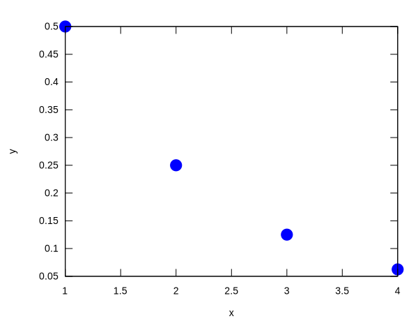

```maxima
set_plot_option([svg_file, "maxplot.svg"])$
```

# Series
* [Home](https://codmccabe.github.io/index.html)
* [Calc Home](https://codmccabe.github.io/calc/index.html)
* [Intro](#intro)
* [Divergence and Integral Test](#diverg)
* [Comparison Tests](#compar)
* [Alternating Series](#altern)
* [Ratio and Root Tests](#ratioRoot)


<a id='intro'></a>
## Intro
* [Home](https://codmccabe.github.io/index.html)
* [Calc Home](https://codmccabe.github.io/calc/index.html)
* [Intro](#intro)
* [Divergence and Integral Test](#diverg)
* [Comparison Tests](#compar)
* [Alternating Series](#altern)
* [Ratio and Root Tests](#ratioRoot)

### Definition (Series)
An infinite series is a sume of infinitely many terms and is written in the form $$\sum_{n=1}^{\infty}a_n = a_1 +a_2 +\cdots$$
and the parital sum of an infinite series is $$S_k = \sum_{n=1}^k a_n = a_1+a_2+\cdots +a_k$$

The partial sum form a sequence $\{S_k\}$. If the sequence of partial sums converges to a real number $S$, the infinite series converges. 

If we can describe the convergence of a series to $S$, we call $S$ the sum of the series, and we write

$$\sum_{n=1}^{\infty}a_n=S$$

If the sequence of partial sums diverges, we have the divergence of a series.

---
### Definition (Harmonic Series)
The harmonic series is defined as $$\sum_{n=1}^{\infty}\frac{1}{n}=1+\frac{1}{2}+\frac13+\cdots$$

---
### Algebraic Properties of Convergent Series

$\newcommand{\SUM}[2]{\sum_{n=1}^{#1}\left(#2\right)}$
Let $\SUM{\infty}{a_n}$ and $\SUM{\infty}{b_n}$ be convegent series. Then the following algebraic properties hold.
1. The series $\SUM{\infty}{a_n\pm b_n}$ converges and $\SUM{\infty}{a_n\pm b_n}=\SUM{\infty}{a_n}\pm \SUM{\infty}{b_n}$
2. For any real number $c$, the series $\SUM{\infty}{ca_n}$ converges and $\SUM{\infty}{ca_n}=c\SUM{\infty}{a_n}$

---
### Defintion (Geometric Series)
A geometric series is a series of the form 

$$\SUM{\infty}{ar^{n-1}}=a+ar+ar^2+ar^3+\cdots$$
* If $|r|<1$, the eries converges, and 

$$\SUM{\infty}{ar^{n-1}}=\frac{a}{1-r}$$ were $|r|<1$.
* If $|r|>1$, the series diverges.

---
### Definition (Telescoping Series)
A telescoping series is a series in which most of the terms cancel in each of the partial sums, leaving only some of the first terms and some of the last terms. For example:
$$\SUM{k}{b_n-b_{n+1}} = b_1-b_{k+1}$$

---


```maxima
sum(1/2,i,1,10);
10*(1/2);
(1/2)^1+(1/2)^2+(1/2)^3+(1/2)^4;
sum((1/2)^n,n,1,4);
plot2d([discrete,makelist((1/2)^i,i,4)],[style,points])$
```


\[\tag{${\it \%o}_{2}$}5\]


\[\tag{${\it \%o}_{3}$}5\]


\[\tag{${\it \%o}_{4}$}{{15}\over{16}}\]


\[\tag{${\it \%o}_{5}$}{{15}\over{16}}\]





As you can see above instead of evaluating:

$$(1/2)^1+(1/2)^2+(1/2)^3+(1/2)^4 = 15/16$$
we compact the notation to:
$$\sum_{n=1}^4 (1/2)^n = 15/16$$


<a id='diverg'></a>
## Divergence and Integral Test
* [Home](https://codmccabe.github.io/index.html)
* [Calc Home](https://codmccabe.github.io/calc/index.html)
* [Intro](#intro)
* [Divergence and Integral Test](#diverg)
* [Comparison Tests](#compar)
* [Alternating Series](#altern)
* [Ratio and Root Tests](#ratioRoot)

### Theorem (Divergence Test)
If $\lim_{n\to \infty}a_n=c\ne 0$ or $\lim_{n\to \infty}a_n$ does not exist, then the series $\SUM{\infty}{a_n}$ diverges.

---
### Theorem (Integral Test)
Consider the series $\SUM{\infty}{a_n}$.
* If the sequence of $a_n$ is made up of positive terms.
* If there exists a function $f$ and a positive integer $N$ such that the following three conditions are satisfied:
1. $f$ is continuous,
2. $f$ is decreasing, and
3. $f(n)=a_n$ for all integers $n\ge N$.

Then
$$\SUM{\infty}{a_n} \text{ and } \int_N^{\infty}f(x)\,dx$$
both converge or both diverge.
### NOTE
Very important to satisfy the three conditions in order to use the Integral test.

---
### Definition ($p$-series)
For any real number $p$, the series $$\SUM{\infty}{\frac{1}{n^p}}$$ is called a $p$-series.

---
### FACTs ($p$-series Convergence or Divergence)
(More will follow after comparison tests like the ratio test and root test)
Given the $p$-series $\SUM{\infty}{\frac{1}{n^p}}$
* If $p<0$, then $1/n^p \to \infty$, and if $p=0$, then $1/n^p \to 1$. Therefore, by the divergence test the $p$-series diverges if $p\le 0$.
* If $p>0$, then $f(x)=1/x^p$ is a positive, continuous, decreasing function (integral test). Therefore, for $p>0$, we use the integral test, comparing $$\SUM{\infty}{\frac{1}{n^p}} \text{ and }\int_1^{\infty}\frac{1}{x^p}\,dx$$ and from improper integrals we know
    - If $p>1$ then the $p$-series converges.
    - if $0<p\le 1$ then the $p$-series diverges.
    
---
### Theorem (Remainder Estimate from the Integral Test)
Suppose $\SUM{\infty}{a_n}$ is a convergent series with positive terms. Suppose there exists a function $f$ satisfying the following three conditions:
1. $f$ is continous,
2. $f$ is decreasing, and
3. $f(n)=a_n$ for all integers $n\ge 1$.

Let $S_N$ be the $N^{\text{th}}$ partial sum of $\SUM{\infty}{a_n}$. For all positive integers $N$,

$$S_N+\int_{N+1}^{\infty}f(x)\,dx<\SUM{\infty}{a_n}<S_N+\int_N^{\infty}f(x)\,dx$$

In other words, the remainder $$R_N=\SUM{\infty}{a_n}-S_N = \sum_{n=N+1}^{\infty}\left(a_n\right)$$
satisfies the following estimate:

$$\int_{N+1}^{\infty}f(x)\,dx < R_n < \int_N^{\infty}f(x)\,dx.$$

---
---
#### Example (Estimating the value of a series)
Consider $\SUM{\infty}{\frac{1}{n^3}}$
1. Find the error for $S_{10}$.
2. Determien the elase value of $N$ necessary such that $S_N$ will estimate $\SUM{\infty}{1/n^3}$ within $0.001$.


```maxima
sum(1/n^3,n,1,10);
float(sum(1/n^3,n,1,10));
f(x):=1/x^3;
integrate(f(x),x);
assume(N>1)$
integrate(f(x),x,1,N);
limit(integrate(f(x),x,1,N),N,infinity);
```


\[\tag{${\it \%o}_{7}$}{{19164113947}\over{16003008000}}\]


\[\tag{${\it \%o}_{8}$}1.197531985674193\]


\[\tag{${\it \%o}_{9}$}f\left(x\right):={{1}\over{x^3}}\]


\[\tag{${\it \%o}_{10}$}-{{1}\over{2\,x^2}}\]


\[\tag{${\it \%o}_{12}$}{{1}\over{2}}-{{1}\over{2\,N^2}}\]


\[\tag{${\it \%o}_{13}$}{{1}\over{2}}\]


As we can see from the calculations the remainder estimate is $R_n=\frac{1}{2N^2}$. So if we want the error for $S_{10}$ we have:


```maxima
Rn(N):=1/(2*N^2);
Rn(10);
float(Rn(10));
```


\[\tag{${\it \%o}_{14}$}{\it Rn}\left(N\right):={{1}\over{2\,N^2}}\]


\[\tag{${\it \%o}_{15}$}{{1}\over{200}}\]


\[\tag{${\it \%o}_{16}$}0.005\]


Now determine least value of $N$. That is solve the following inequality:
$$R_N<0.001 \text{ or } \frac{1}{2N^2}<0.001$$


```maxima
assume(N>1)$
solve(1/(2*N^2)=0.001,N);
float(solve(1/(2*N^2)=0.001,N));
```

    
    rat: replaced -0.001 by -1/1000 = -0.001


\[\tag{${\it \%o}_{18}$}\left[ N=-2\,5^{{{3}\over{2}}} , N=2\,5^{{{3}\over{2}}} \right] \]


    
    rat: replaced -0.001 by -1/1000 = -0.001


\[\tag{${\it \%o}_{19}$}\left[ N=-22.3606797749979 , N=22.3606797749979 \right] \]


Therefore, the minimum necessary value is $N=23$.

---
---

<a id='compar'></a>
## Comparison Test
* [Home](https://codmccabe.github.io/index.html)
* [Calc Home](https://codmccabe.github.io/calc/index.html)
* [Intro](#intro)
* [Divergence and Integral Test](#diverg)
* [Comparison Tests](#compar)
* [Alternating Series](#altern)
* [Ratio and Root Tests](#ratioRoot)

### Theorem (Comparison Test)
1. Suppose there exists an integer $N$ such that $0\le a_n\le b_n$ for all $n\ge N$. If $\SUM{\infty}{b_n}$ converges, then $\SUM{\infty}{a_n}$ converges.
2. Suppose there exists an integer $N$ such that $a_n\ge b_n\ge 0$ for all $n\ge N$. If $\SUM{\infty}{b_n}$ diverges, then $\SUM{\infty}{a_n}$ diverges.

---
### Theorem (Limit Comparison Test)
Let $a_n$, $b_n\ge 0$ for all $n\ge 1$.
1. If $\lim_{n\to \infty}\left(a_n/b_n\right) = L \ne 0$, then $\SUM{\infty}{a_n}$ and $\SUM{\infty}{b_n}$ both converge or both diverge.
2. If $\lim_{n\to \infty}\left(a_n/b_n\right) = 0$ and $\SUM{\infty}{b_n}$ converges, then $\SUM{\infty}{a_n}$ converges
3. If $\lim_{n\to \infty}\left(a_n/b_n\right) = \infty$ and $\SUM{\infty}{b_n}$ diverges, then $\SUM{\infty}{a_n}$ diverges.

---

<a id='altern'></a>
## Alternating Series
* [Home](https://codmccabe.github.io/index.html)
* [Calc Home](https://codmccabe.github.io/calc/index.html)
* [Intro](#intro)
* [Divergence and Integral Test](#diverg)
* [Comparison Tests](#compar)
* [Alternating Series](#altern)
* [Ratio and Root Tests](#ratioRoot)

### Definition (Alternating Series)
Any series whose terms alternate between positive and negative values is called an alternating series. An alternating series can be written in the form

$$\SUM{\infty}{(-1)^{n+1}b_n} = b_1 -b_2+b_3-b_4+\cdots$$
or
$$\SUM{\infty}{(-1)^n b_n} = -b_1+b_2-b_3+b_4-\cdots$$

where $b_n\ge 0$ for all positive integers $n$.

---
### Theorem (Alternating Series Test)
An alternating series of the form
$$\SUM{\infty}{(-1)^{n+1}b_n}\text{ or } \SUM{\infty}{(-1)^n b_n}$$
converges if
1. $0\le b_{n+1} \le b_n$ for all $n\ge 1$ and
2. $\lim_{n\to \infty}b_n=0$.

---
### Theorem (Remainders in Alternating Series)
Consider the alternating series of the form
$$\SUM{\infty}{(-1)^{n+1}b_n} \text{ or }\SUM{\infty}{(-1)^nb_n}$$
that satisfies the hypotheses of the alternating series test.

Let $S$ denote the sum of the series and $S_N$ denote the $N^{\text{th}}$ partial sum. For any integer $N\ge 1$, the remainder $R_N = S - S_N$ satisfies
$$|R_N|\le b_{N+1}$$

---
### Definition (Absolute and Condition Convergence)
A series $\SUM{\infty}{a_n}$ exhibits absolute convergence if $\SUM{\infty}{|a_n|}$ converges. A series $\SUM{\infty}{a_n}$ exhibits conditional convergence if $\SUM{\infty}{a_n}$ converges but $\SUM{\infty}{|a_n|}$ diverges.

---
### Theorem (Absolute Convergence Implies Convergence)
If $\SUM{\infty}{|a_n|}$ converges, then $\SUM{\infty}{a_n}$ converges.

---

<a id='ratioRoot'></a>
## Ratio and Root Tests
* [Home](https://codmccabe.github.io/index.html)
* [Calc Home](https://codmccabe.github.io/calc/index.html)
* [Intro](#intro)
* [Divergence and Integral Test](#diverg)
* [Comparison Tests](#compar)
* [Alternating Series](#altern)
* [Ratio and Root Tests](#ratioRoot)

### Theorem (Ratio Test)
Let $\SUM{\infty}{a_n}$ be a series with nonzero terms. Let
$$\rho = \lim_{n\to \infty}\left|\frac{a_{n+1}}{a_n}\right|.$$

1. If $0\le\rho <1$, then $\SUM{\infty}{a_n}$ converges absolutely.
2. If $\rho >1$ or $\rho = \infty$, then $\SUM{\infty}{a_n}$ diverges.
3. If $\rho = 1$, the test does not provide any information.

---
### Theorem (Root Test)
Consider the series $\SUM{\infty}{a_n}$. Let 
$$\rho = \lim_{n\to \infty}\sqrt[n]{\left|a_n\right|}$$
1. If $0\le \rho <1$, then $\SUM{\infty}{a_n}$ converges absolutely.
2. If $\rho > 1$ or $\rho = \infty$, then $\SUM{\infty}{a_n}$ diverges.
3. If $\rho = 1$, the test does not provide any information.

---


 <table style="width:100%">
  <tr>
    <th>Series or Test</th>
      <th>Conclusions</th>
      <th>Comments</th>
  </tr>
    
  <tr>
    <th rowspan="2">
        <p>Divergence Test </p>
        
        <p>For any series $\sum_{n=1}^{\infty}(a_{n})$, evaluate $\lim_{n\to\infty}(a_{n})$.</p></th>
    <td>If $\lim_{n\to\infty}(a_{n})=0$, the test is inconclusive.</td>
      <td>The test cannot prove convergence of a series.</td>
  </tr>
  <tr>
    <td>If $\lim_{n\to\infty}(a_{n})\ne0$, the series diverges.</td>
  
  </tr>
    
    <tr>
    <th rowspan="2">
        <p>Geometric Series </p>
        
        <p>$\sum_{n=1}^{\infty}\left(ar^{n-1}\right)$</p></th>
    <td>If $|r|<1$, the series converges to $\frac{a}{1-r}$.</td>
      <td>Any geometric series can be re-indexed to be written in the form $a+ar+ar^{2}+\cdots$,
where $a$ is the initial term and $r$ is the ratio.</td>
  </tr>
  <tr>
    <td>If $|r|\ge1$, the series diverges.</td>
  
    </tr>
    
    <tr>
    <th rowspan="2">
        <p>$p$-Series </p>
        
        <p>$\sum_{n=1}^{\infty}\left(\frac{1}{n^{p}}\right)$</p></th>
    <td>If $p>1$, the series converges.</td>
      <td>For $p=1$, we have the harmonic series $\sum_{n=1}^{\infty}\left(\frac{1}{n}\right)$.</td>
  </tr>
  <tr>
    <td>If $p\le1$, the series diverges.</td>
  
    </tr>
    
     <tr>
    <th rowspan="2">
        <p>Comparison Test </p>
        
        <p>For $\sum_{n=1}^{\infty}(a_{n})$ with nonnegative terms, compare with a known series $\sum_{n=1}^{\infty}(b_{n})$.</p></th>
    <td>If $a_{n}\le b_{n}$ for all $n\ge N$ and $\sum_{n=1}^{\infty}(b_{n})$
converges, then $\sum_{n=1}^{\infty}(a_{n})$ converges</td>
      <td>Typically used for a series similar to a geometric or $p$-series.
It can sometimes be difficult to find an appropriate series.</td>
  </tr>
  <tr>
    <td>If $a_{n}\ge b_{n}$ for all $n\ge N$ and $\sum_{n=1}^{\infty}(b_{n})$
diverges, then $\sum_{n=1}^{\infty}(a_{n})$ diverges.</td>
  
    </tr>
    
     <tr>
    <th rowspan="3">
        <p>Limit Comparison Test </p>
        
        <p>For $\sum_{n=1}^{\infty}(a_{n})$ with positive terms, compare with a series $\sum_{n=1}^{\infty}(b_{n})$ by evaluating $L=\lim_{n\to\infty}\frac{a_{n}}{b_{n}}$.</p></th>
    <td>If $L$ is a real number and $L\ne0$, then $\sum_{n=1}^{\infty}(a_{n})$
and $\sum_{n=1}^{\infty}(b_{n})$ both converge or both diverge.</td>
      <td>Typically used for a series similar to a geometric or p-series. Often
easier to apply than the comparison test.</td>
  </tr>
  <tr>
    <td>If $L=0$ and $\sum_{n=1}^{\infty}(b_{n})$ converges, then $\sum_{n=1}^{\infty}(a_{n})$
converges.</td>
      </tr>
    <tr>
        <td> If $L=\infty$ and $\sum_{n=1}^{\infty}(b_{n})$ diverges, then $\sum_{n=1}^{\infty}(a_{n})$
diverges.</td>
    </tr>
    
    
    <tr>
        <th><p> Integral Test</p>
            <p> If there exists a positive, continuous, decreasing function $f$ such
                that $a_{n}=f(n)$ for all $n\ge N,$evaluate $\int_{N}^{\infty}f(x)\,dx$.</p>
        </th>
        <td>$\int_{N}^{\infty}f(x)\,dx$ and $\sum_{n=1}^{\infty}(a_{n})$ both
converge or both diverge. </td>
        <td> Limited to those series for which the corresponding function $f$
            can be easily integrated.</td>
    </tr>
    
    <tr>
        <th><p>Alternating Series</p>
            <p> $\sum_{n=1}^{\infty}\left((-1)^{n+1}b_{n}\right)$ or $\sum_{n=1}^{\infty}\left((-1)^{n}b_{n}\right)$</p>
        </th>
        <td>If $b_{n+1}\le b_{n}$ for all $n\ge1$ and $b_{n}\to0$ as $n\to\infty$,
then the series converges.</td>
        <td>  Only applies to alternating series.</td>
    </tr>
   
    <tr>
    <th rowspan="3">
        <p>Ratio Test</p>
        
        <p>For any series $\sum_{n=1}^{\infty}(a_{n})$ with nonzero terms, let
$\rho=\lim_{n\to\infty}\left|\dfrac{a_{n+1}}{a_{n}}\right|$.</p></th>
    <td>If $0\le\rho<1$, the series converges absolutely.</td>
      <td>Often used for series involving factorials or exponential.</td>
  </tr>
  <tr>
    <td>If $\rho>1$ or $\rho=\infty$, the series diverges.</td>
      </tr>
    <tr>
        <td> If $\rho=1$, the test is inconclusive.</td>
    </tr>
    
    <tr>
    <th rowspan="3">
        <p>Root Test</p>
        
        <p>For any series $\sum_{n=1}^{\infty}(a_{n})$ with nonzero terms, let
$\rho=\lim_{n\to\infty}\sqrt[n]{|a_{n}|}$.</p></th>
     <td>If $0\le\rho<1$, the series converges absolutely.</td>
      <td>Often used for series where $|a_n|=b_n^n$</td>
  </tr>
  <tr>
    <td>If $\rho>1$ or $\rho=\infty$, the series diverges.</td>
      </tr>
    <tr>
        <td> If $\rho=1$, the test is inconclusive.</td>
    </tr>
    
    
</table> 
